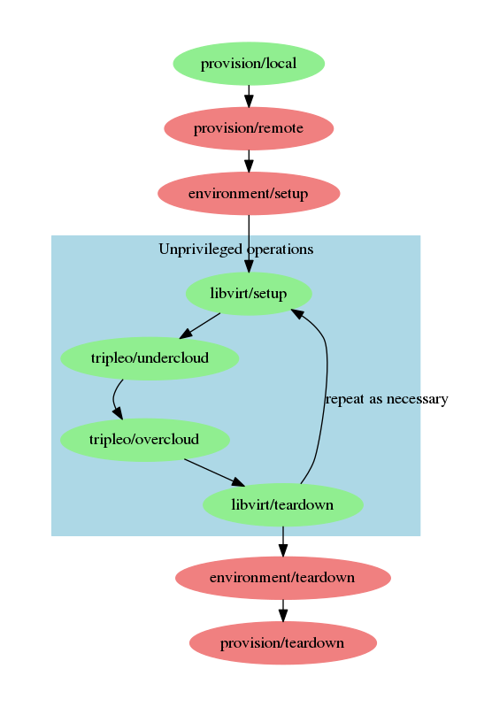

# Tripleo-quickstart roles

(This documentation was assembled automatically)

## Overview

The following diagram illustrates the workflow of the
tripleo-quickstart process.  Roles colored red require root privileges on the remote host; roles
colored green are run as an
unprivileged user.

## Roles
